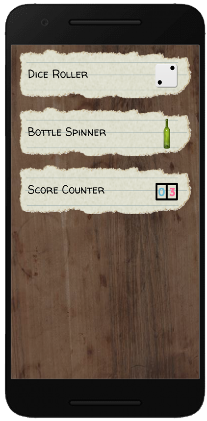
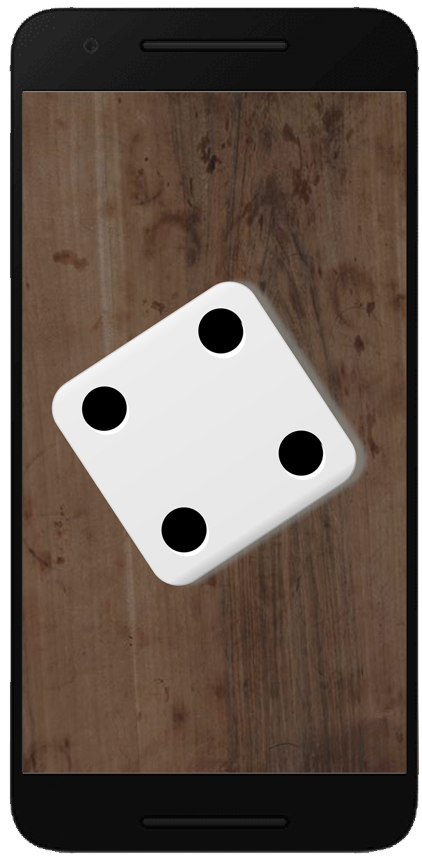
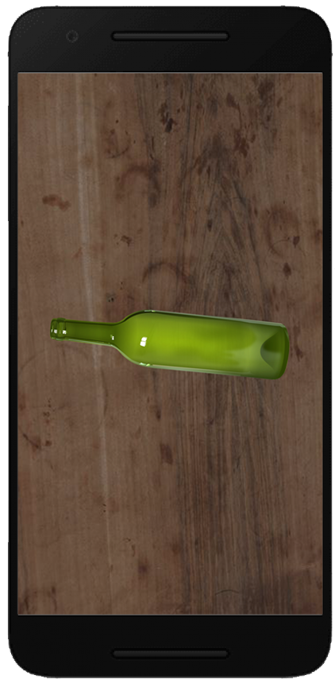
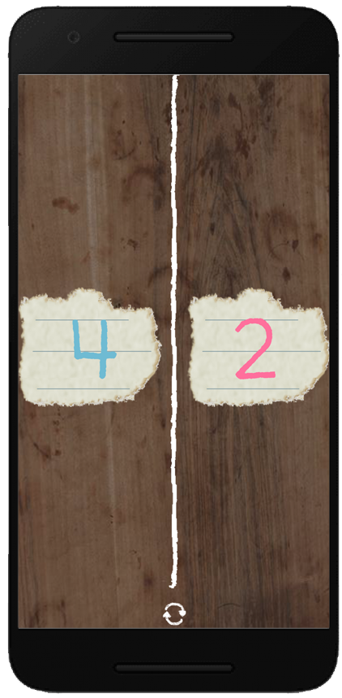

   

<h1 align="left">Truth or Dare - Game Tools</h1>

>A native android app with tools to make your games more fun, it has a Bottle Spinner for truth or dare, a Dice Roller for dice games and a Score Counter for games in general.

&nbsp;
&nbsp;
&nbsp;

  
  
  
  

&nbsp;
&nbsp;
&nbsp;

<a href="https://play.google.com/store/apps/details?id=com.truthordare.gametools">
  

    
  

 </a>
